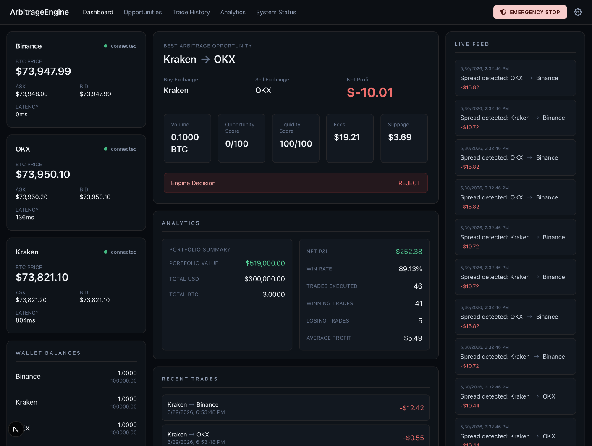
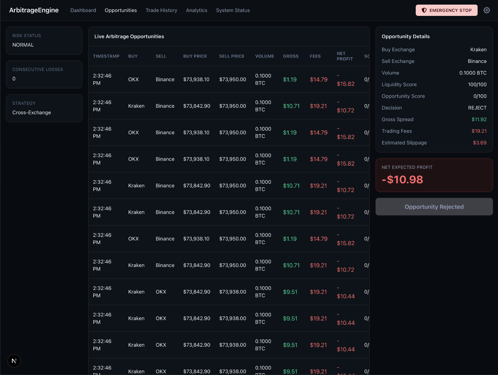
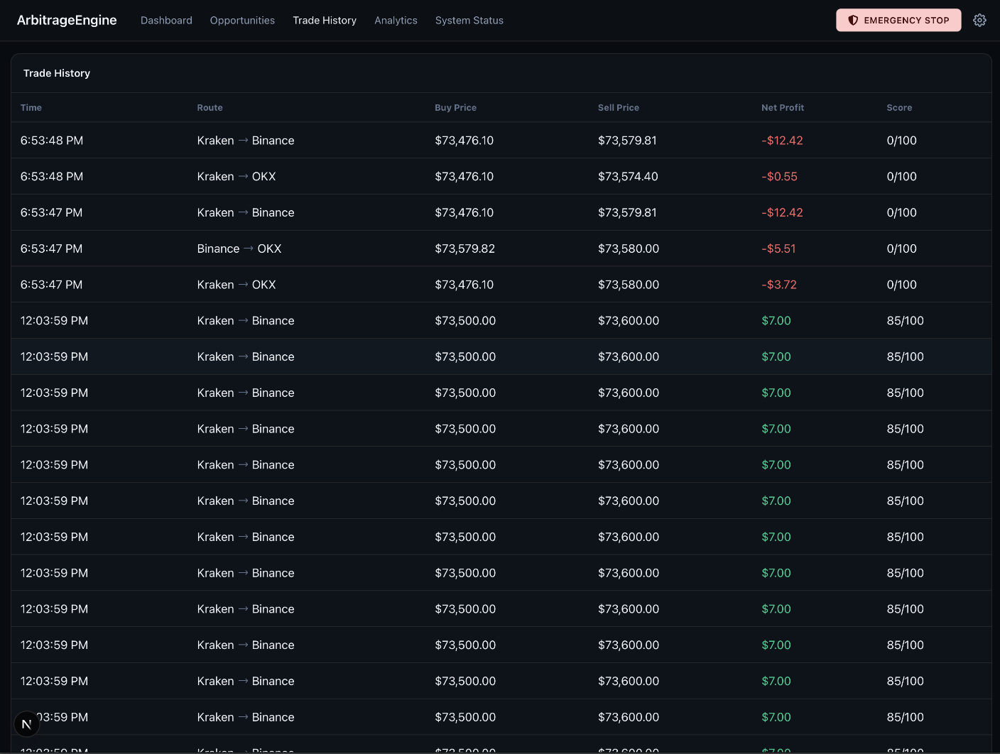
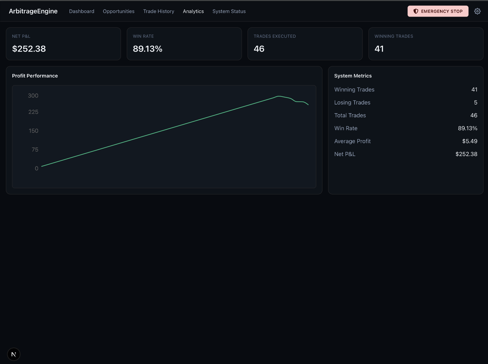
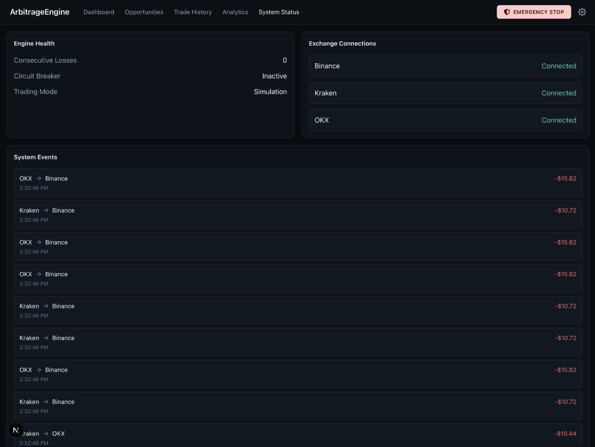

# Arbitrage Engine

## Overview

Arbitrage Engine is a real-time Bitcoin arbitrage simulation platform built with Next.js and TypeScript.

The system monitors multiple cryptocurrency exchanges through WebSocket connections, detects cross-exchange arbitrage opportunities, evaluates profitability after trading fees and slippage, simulates trade execution, updates wallet balances, and tracks trading performance through a web dashboard.

The project was developed as part of a Bitcoin Arbitrage Trading Challenge focused on real-time market monitoring, opportunity detection, risk management, and performance visualization.

---

## Features

- Real-time BTC market monitoring using WebSockets
- Multi-exchange support (Binance, Kraken and OKX)
- Cross-exchange arbitrage detection
- Trading fee calculation
- Slippage estimation
- Liquidity analysis
- Partial order handling
- Opportunity scoring system
- Simulated trade execution
- Wallet balance management
- Trade history tracking
- Performance analytics dashboard
- Circuit breaker risk management

---

## Technology Stack

### Frontend

- Next.js 16 (App Router)
- React 19
- TypeScript
- Tailwind CSS

### Backend & Storage

- Supabase

### Data Visualization

- Recharts

### Market Data

- Binance WebSocket API
- Kraken WebSocket API
- OKX WebSocket API

---

## Architecture

The application follows a feature-based architecture.

Main modules:

- arbitrage-engine
- dashboard
- opportunities
- analytics
- trade-history
- system-status
- wallets

High-level flow:

Market Streams → Market Cache → Arbitrage Detection → Opportunity Evaluation → Trade Simulation → Wallet Updates → Trade Persistence → Analytics & Dashboard

---

## Trading Logic

The engine evaluates opportunities using:

- Trading fees
- Estimated slippage
- Available liquidity
- Opportunity score

Current strategy parameters:

- Maximum position size: 0.1 BTC
- Minimum net profit: $25 USD
- Minimum executable volume: 0.01 BTC

Trades are executed only when profitability and liquidity requirements are satisfied.

---

## Wallet Simulation

Each exchange maintains an independent simulated wallet balance.

When a trade is executed:

- The buy exchange spends USD and receives BTC.
- The sell exchange receives USD and spends BTC.

Wallet balances are updated after every simulated trade.

---

## Design Decisions

The system operates using pre-funded wallets on each exchange.

Withdrawal fees are considered only during exchange rebalancing operations and not during every arbitrage trade, since assets are already available on each exchange wallet.

This approach reflects how many cross-exchange arbitrage systems operate in practice and avoids introducing artificial transfer delays into every simulated trade.

---

## Installation and Execution

Install dependencies:

```bash
pnpm install
```

Create a `.env.local` file using the values provided in `.env.example`.

Start the development server:

```bash
pnpm dev
```

The application will be available at:

```txt
http://localhost:3000
```

## Screenshots

### Dashboard



### Opportunities



### Trade History



### Analytics



### System Status



```

```
